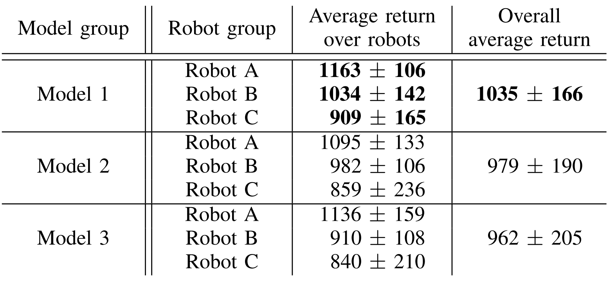
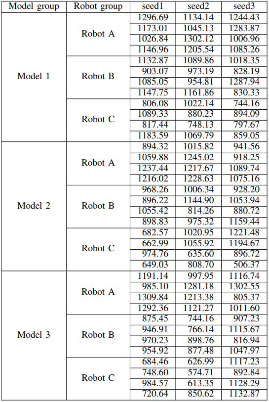

# Real Robot Challenge III winning solution --- team excludedrice
This repository contains the source Python scripts for our solutions to Real Robot Challenge (RRC) III. Furthermore, it functions as the website hosting the code and presenting an extension of the discussion from our paper, which is based on the results we achieved in RRC III. (We will put the link of the paper once it get accpted)

## Contents
- rrc2022: This folder contains the scripts for deploying the trained models on the real robot cluster.
- trained_models: This folder contains our final submitted models to the RRC2022.
- dataset_aug.py: The dataset augmentation script.
- dataset_filter.py: The main scripts for filtering the mixed dataset.
- main_bc_train_tune.py: The main scripts for training the BC models.
- models.py: The neural networks.
- trainer.py: The implementations of Behaviour Cloning(BC)
- utils.py: Tools.
- requirements.txt: The required python libraries.

## Installation
**1.** Our implementations are tested only on [Anadonda](https://www.anaconda.com/products/distribution). We recommend you install Anaconda if you would reproduce our work, although other development environments should also work. Our python version is 3.8.13

**2.** Activate your vitural environment(or others) and run:

    pip install -r requirements.txt
        
where we installed the official RRC 2022 library through the local installation method; please see the [official document](https://webdav.tuebingen.mpg.de/real-robot-challenge/2022/docs/simulation_phase/index.html#get-the-software) for more details. 

## Reproducing our experiments
In our experiment, we mainly has three part. 

1) Filter the mixed dataset. **Note: Start from step 2 if you are training from the expert dataset**
2) Augment the dataset by geometry. 
3) Traing the Behaviour Cloning(BC) model. 

Because the RRC dataset is large, our approach for processing the mixed datasets requires a machine with 16GB RAM, whereas for the expert datasets, we require 32GB. To save the RAM, we keep saving the file on SSD from RAM and load it in the next iteration; hence you should have at least 50GB of free space left on your SSD.

### Filter the mixed dataset
Only the mixed datasets need to be filtered, and this step will not work for the expert dataset. Some errors will be raised if you are trying to filter the expert datasets. Assuming you filter the lift mixed dataset, activate your virtual environment and run the following command.
    
    python dataset_filter.py --task="real_lift_mix"
    
**!!!Note!!!: The abbreviations of four tasks are "real_lift_mix", "real_lift_exp", "real_push_mix", "real_push_mix".**

This process would take 1-2 hours. After this process, you will see a new "save" folder that includes all training and filtering history files. Now you can delete everything except!!! **turn_final_positive.npy** if you want to save SSD space.
    
### Augment the dataset by geometry
Once the dataset is filtered, or if you are training from the expert dataset. Run the following command(assuming you are processing the lift mixed dataset):
    
    python dataset_aug.py --task="real_lift_mix"
    
This pricess would take 40-60 minutes. After the process, you will see a new **xxx_aug.npy** file.

### Train BC models
Note: The normalization only works for the lift task and does not work for the push. Assuming you are training the lift mixed task, run:
    
    python main_bc_train_tune.py --exp-name="real_push_mix_test1" --task="real_lift_mix" --norm=1
    
Once this process finished, you will see trained models in **"./save/real_lift_mix/models/xxx_tune"**, make you enter the correct name.

## Deploy the model on the real robot
The deployment scripts is in under "rrc2022" folder. Steps:
1) Upload the trained BC model and the normalization parameters on  RRC robot cluster(more details see the [website](https://webdav.tuebingen.mpg.de/real-robot-challenge/2022/docs/robot_phase/submission_system.html)). You can find the model in **"./save/real_lift_mix/models/xxx_tune/ckpt_50.pth"** and you can find the normalization parameters in **"./save/real_lift_mix/datasets/train_aug_norm_params.npy"**.
2) Change the file's name in the deployment script to make them direct to the models you submitted; you can do this by easily editing the files located in rrc2022 on GitHub.
3) Submit jobs to the system.

# Discussion on the efficacy of our train-and-tune methodology
In the study presented in [1], it was found that decreasing the learning rate of BC leads to improved policies for physical robots. To verify that the performance improvement from our "train-and-tune" approach wasn't merely due to a reduced learning rate in the tuning phase, we carried out an extensive investigation. Due to space constraints in our article, we had to place this part of the discussion here. The origin of this part of the research stemmed from the valuable feedback given by reviewers from [IEEE Robotics and Automation Letters](https://www.ieee-ras.org/publications/ra-l). Their insights during the review phase helped us identify this issue, for which we are profoundly grateful.

Here, we reached out to the competition organizers once again to request access to the robots. We are grateful that they granted the access again. Unfortunately, the evaluation environment differs slightly from the competition setting: only 3 out of the 6 robots are currently available, whereas all 6 were accessible during the competition.

## Experiments
We trained the following models (Note: All models were tested to assess overfitting, and none exhibited signs of overfitting): 
1) **Our Solution**: Given the change in the number of available robots, we cannot rely on the competition results for a fair comparison here. Instead, we re-evaluated our winning behavioural cloning (BC) model, which was initially trained for $\sim2.5 \times 10 ^{5}$ steps with a batch size of 1024, using an augmented dataset and a higher learning rate of $1 \times 10 ^{-3}$; it was then fine-tuned on the raw dataset for shorter duration of around $\sim8 \times 10 ^{4}$ steps, maintaining the same batch size of 1024 but reducing the learning rate to $2 \times 10 ^{-4}$.
2) **Training with reduced learning rate and extended training duration**: We trained a BC model on the augmented dataset for $\sim5 \times 10 ^{5}$ steps (batch size of 1024), which is twice the duration mentioned in the previous approach. We employed a smaller learning rate of $2 \times 10 ^{-4}$.
3) **Fine-tuning on the augmented dataset with reduced learning rate**: The initial training stage is the same as described in approach 1), with the key difference being that the fine-tuning process is conducted on the augmented dataset rather than the raw dataset. The learning rate, batch size, and training duration remain identical to those in approach 1).

We trained three models, each with a distinct random seed, for each of the scenarios mentioned above. Each model was evaluated on different robots, with 20 trajectories for each robot.

## Results and Discussion
The evaluation results are shown in **_TABLE. 1_** (see **_TABLE. 2_** for the raw and detailed evaluation results before averaging). Our model (Model 1) outperforms the other two comparison groups both overall and individually for each robot. It's worth noting that the same model might show different performances on different robots. This can primarily be attributed to the inherent flaws of the actual mechanical systems, such as deviations in electronic components, inconsistencies in physical connections, and wear and tear during use. These factors are hard to avoid and cannot be overlooked. Based on this, we speculate that even with consistent design, the physical characteristics of different fingers on the same trifinger robot might still differ, leading to a noticeable bias between its state space and rotationally symmetric state space.

Therefore, theoretically, augmenting the data may generate data that does not exist in real-world scenarios, potentially causing the model to learn policies that deviate from the actual data distribution. Despite this, this data augmentation method indeed enhances the model's robustness. Since real-world scenarios are continuous and complex, the starting positions and goals in each trajectory are highly likely to vary. Hence, the collected data only covers a (small) part of the entire possible state space. When deploying the model, it might encounter states or goals that deviate from the training dataset.  Through our data augmentation method, we can attempt to increase the coverage of the state space in the dataset, ensuring that models trained on augmented datasets are more likely to encounter a broader range of scenarios before deployment. This, in turn, helps reduce the compound error of BC.

    <figcaption><i><b>TABLE. 1 </b>The scores assessed from three robots compare our method to two</i></figcaption>
     
    <figcaption><i>other models trained with lower learning rates and/or extended training duration</i></figcaption>
     
    <figcaption><i>These results are averaged across three distinct random seeds, with each model</i></figcaption>
     
    <figcaption><i>tested on 20 trajectories per seed for each robot.</i></figcaption>
     
    <figcaption><i></i></figcaption>
     
    

Although the augmented dataset can provide a broader perspective for the model when finding solution trajectories, it's important to note that due to differences between the actual state space and the symmetrical augmented state space, the model's performance might decline when handling specific detailed manipulations.

## Raw evaluation results
This section presents the raw evaluation results for **_TABLE. 1_**, offering a detailed overview of the outcomes for each seed and each robot prior to averaging. It's important to note that, in accordance with the RRC evaluation protocol, each evaluation is assigned 5 random trajectories, and the output is then averaged. Consequently, each cell in the table represents the average of 5 trajectories.

    <figcaption><i><b>TABLE. 2 </b>The raw evaluation results of <b>TABLE. 1 </b></i></figcaption>
     
    

##
